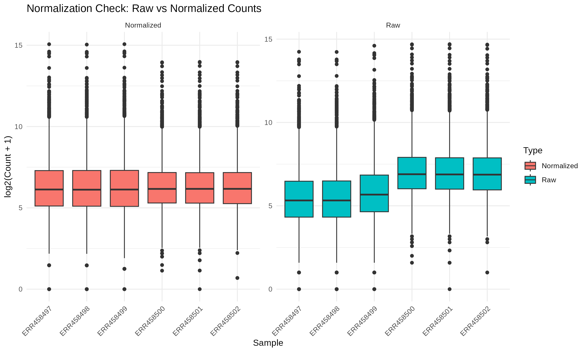
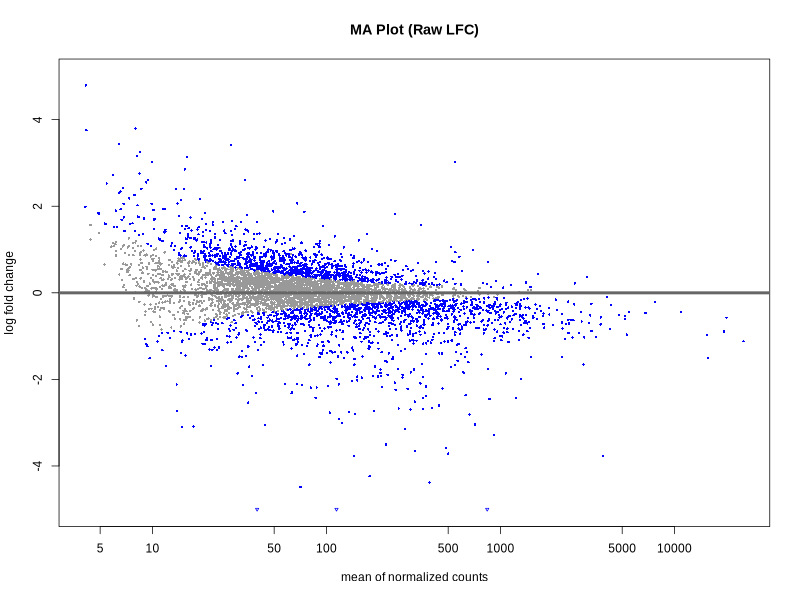
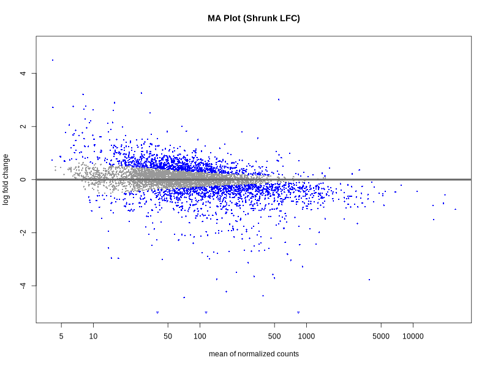

# 02 DGE & Normalization Summary

## Normalization
Normalization was performed using the **Median of Ratios** method (DESeq2).

## Differential Expression Overview
- **Significant DEGs** (padj < 0.05 , |LFC| > 1 ): 366
  - **Up-regulated:** 138
  - **Down-regulated:** 228

## MA Plots
### Before LFC Shrinkage

### After LFC Shrinkage (apeglm)

## Top 5 Up-regulated Genes
| GeneID | Log2FC | padj |
| :--- | :--- | :--- |
| YIR018C-A | 4.5 |  7.90e-04 |
| YGR051C | 3.26 |  3.65e-10 |
| YCL048W | 3.21 |  1.86e-03 |
| YER081W | 3.01 | 2.31e-175 |
| YPL025C | 2.89 |  5.96e-06 |

## Top 5 Down-regulated Genes
| GeneID | Log2FC | padj |
| :--- | :--- | :--- |
| YOR290C | -8.39 |  4.60e-23 |
| YHR215W | -5.17 |  1.89e-25 |
| YML123C | -5.05 |  0.00e+00 |
| YHR136C | -4.45 |  5.20e-50 |
| YGR234W | -4.38 | 1.02e-259 |
