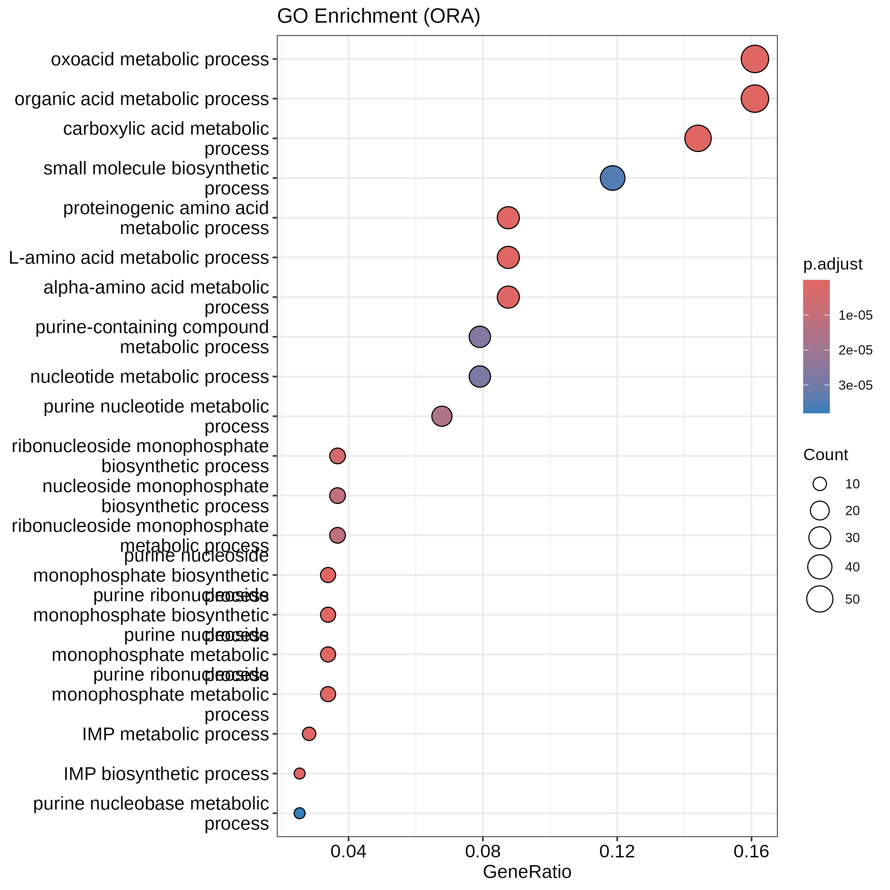
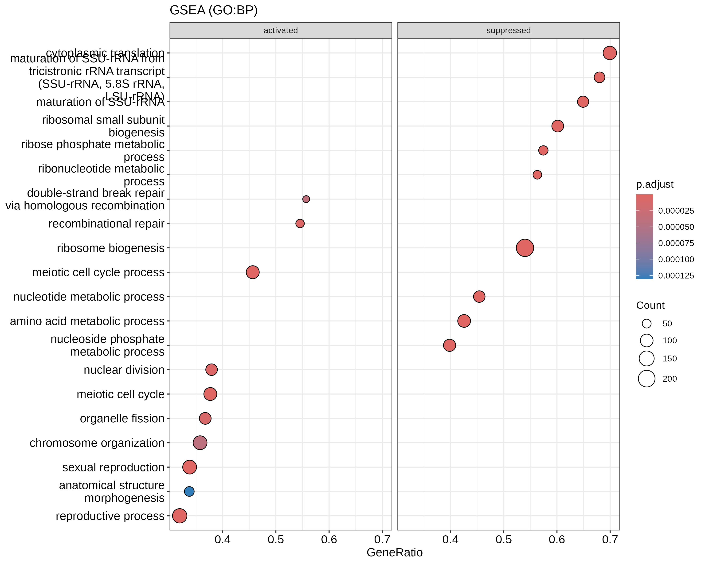
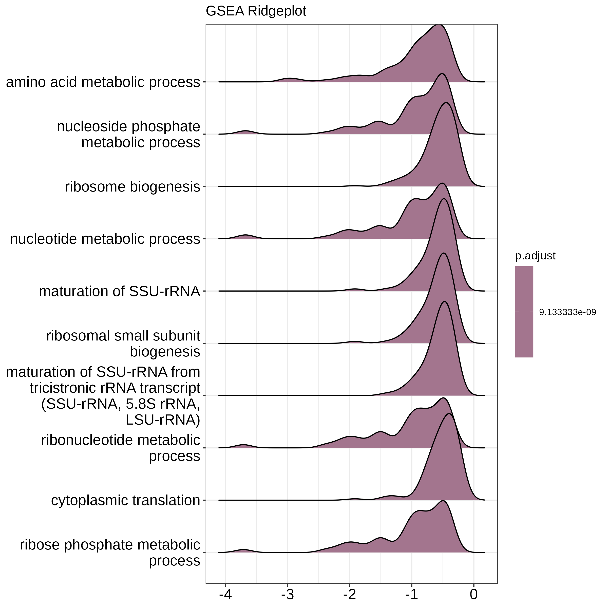

# 03 Enrichment Summary

## Over-Representation Analysis (ORA)
- **Significant GO Terms (BP):** 74

| ID | Description | p.adjust | Count |
| :--- | :--- | :--- | :--- |
| GO:0043436 | oxoacid metabolic process | 1.09e-09 | 57 |
| GO:0006082 | organic acid metabolic process | 1.09e-09 | 57 |
| GO:0046040 | IMP metabolic process | 2.04e-08 | 10 |
| GO:0009127 | purine nucleoside monophosphate biosynthetic pr... | 5.51e-08 | 12 |
| GO:0009168 | purine ribonucleoside monophosphate biosyntheti... | 5.51e-08 | 12 |

## Gene Set Enrichment Analysis (GSEA)
- **Significant Enriched Terms:** 278

| ID | Description | NES | p.adjust |
| :--- | :--- | :--- | :--- |
| GO:0019693 | ribose phosphate metabolic process | -2.47 | 9.13e-09 |
| GO:0002181 | cytoplasmic translation | -2.43 | 9.13e-09 |
| GO:0009259 | ribonucleotide metabolic process | -2.42 | 9.13e-09 |
| GO:0000462 | maturation of SSU-rRNA from tricistronic rRNA t... | -2.42 | 9.13e-09 |
| GO:0042274 | ribosomal small subunit biogenesis | -2.39 | 9.13e-09 |
